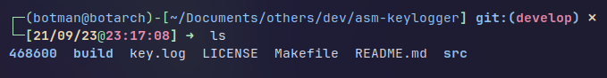

# fully x64 ASM keylogger

### /!\ this is for educational purpose only, any others use is prohibited /!\

## Usage

### Compilation
```bash
make
```

### Run
```
sudo build/keylogger
```

### Kill the keylogger
you first have to find the PID of the process, for that the keylloger create a dir with pid like this:


then umount it and kill it
```
sudo umount /proc/<pid>
sudo killall -9 build/keylogger
```

## Docs
[man for all the syscalls](https://man7.org/linux/man-pages/)

[asm doc](https://www.tutorialspoint.com/assembly_programming)

[calltable](https://x64.syscall.sh/)

[linux source code (easier than github official repo)](https://elixir.bootlin.com/linux/latest/source)
